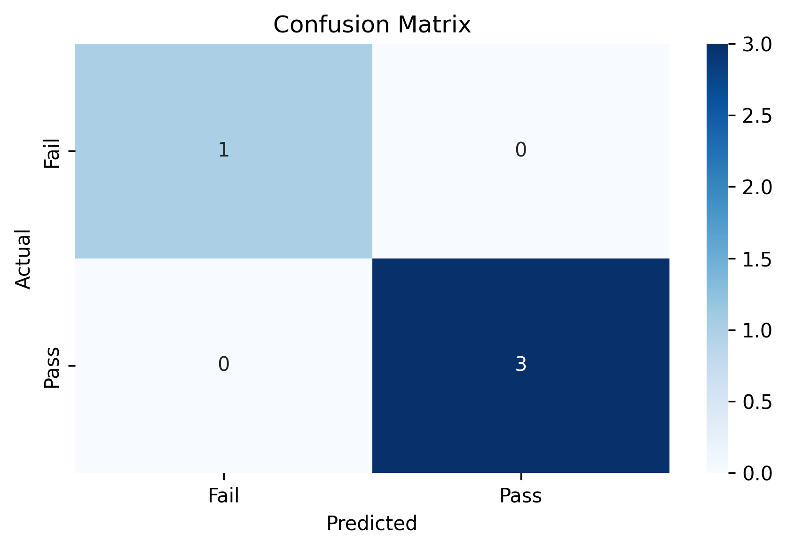

# 🎓 Student Success Predictor  

A **Machine Learning project** that predicts whether a student will **Pass** or **Fail** based on key academic and behavioral factors such as study hours, attendance, past scores, and sleep hours.  

This project combines data preprocessing, feature scaling, logistic regression, and model evaluation using **Scikit-learn**, **Pandas**, **NumPy**, **Matplotlib**, and **Seaborn**.  

---

## 📘 Overview  

This project demonstrates the use of **Supervised Machine Learning** techniques for classification, and also integrates foundational mathematical and preprocessing concepts that are essential in **AI/ML** pipelines.

### 🎯 Objective  
To predict a student's success (Pass/Fail) using multiple real-world factors and evaluate model accuracy using metrics such as **Precision**, **Recall**, **F1-score**, and **Accuracy**.

---

## 🧩 Features  

- Data Cleaning and Preprocessing  
- Label Encoding for categorical features  
- Feature Scaling using `StandardScaler`  
- Model Training using Logistic Regression  
- Model Evaluation (Classification Report, Confusion Matrix)  
- User Input Prediction (Interactive Console)  

---

## 🧠 Technologies Used  

| Category | Libraries |
|-----------|------------|
| Data Handling | pandas, numpy |
| Visualization | matplotlib, seaborn |
| Machine Learning | scikit-learn |
| Metrics | classification_report, confusion_matrix |

---

## 📊 Model Performance  

| Metric | Score |
|--------|--------|
| Accuracy | 1.00 |
| Precision | 1.00 |
| Recall | 1.00 |
| F1-score | 1.00 |

---

## 🖼️ Output Visualizations  

### Confusion Matrix  


### Example Console Output  
- Enter study hours: 7
- Enter attendance: 85
- Enter past score: 78
- Enter sleep hours: 6
- Prediction based on input: Pass


---

## ⚙️ How to Run  

1. Clone the repository:
   ```bash
   git clone https://github.com/<your-username>/student-success-predictor.git
   cd student-success-predictor

2. Install dependencies:
   ```bash
   pip install -r requirements.txt

3. Run the program:
   ```bash
   python student_success_predictor.py